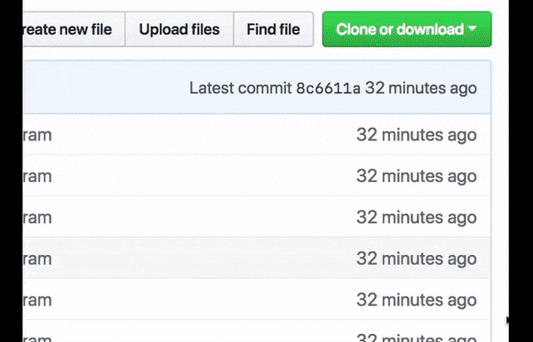
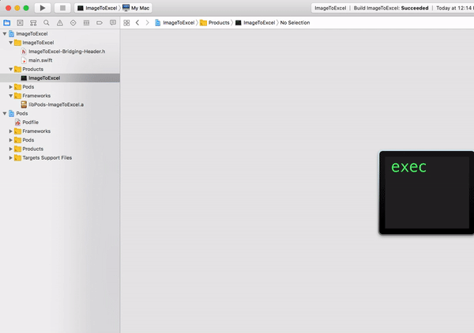
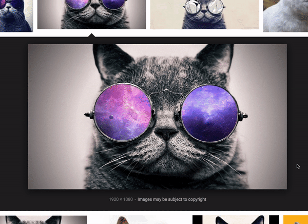
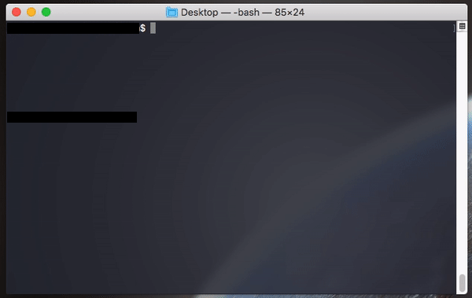
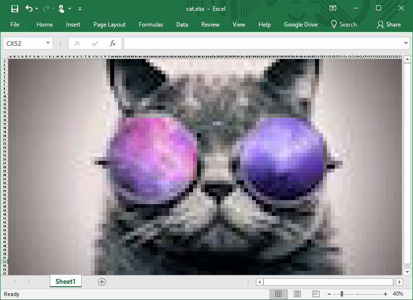

# ImageToExcel

A simple Swift command-line program to convert an image into an Excel spreadsheet using QuartzCore and [libxlsxwriter](https://libxlsxwriter.github.io/).

# Usage

### Clone & build the project

### Copy the executable to your location of choice

### Find an image

### Run the program

### Profit

`./ImageToExcel path/to/image [optional-path-to-output.xlsx]`

# Image Support

Since this is a macOS application, **ImageToExcel** supports any image format supported by QuartzCore and Cocoa (`NSImage` and `CGImage`.) Currently, it does **not** support images with alpha — any transparency will appear as black on the created spreadsheet.

# Motivation

I and many others share the desire to have images implemented in Microsoft Excel **the proper way™**. The result of this desire is **ImageToExcel**. You'll never have to worry about image compatibility with other devices again; if your computer can run the $399 Microsoft Office suite, it can open the files created by **ImageToExcel**!

# Contributing

I'll gladly accept contributions to **ImageToExcel** — just submit a pull request! If you have any issues, open an issue. If you'd like to invest in **ImageToExcel** because you see its real-world potential across millions of clients that have previously struggled to convert images to Excel spreadsheets, let me know. :)

And finally, have a *wonderful* day.
